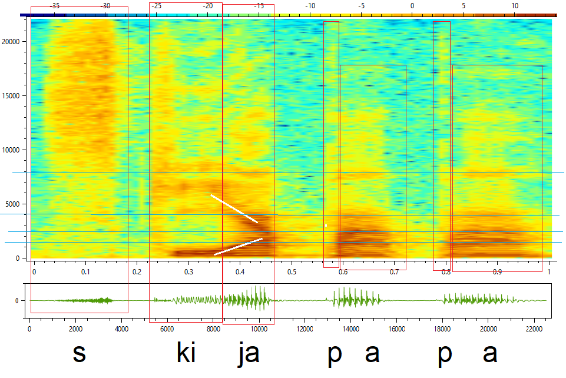

# Audio analysis and processing - Project 2

## Features

- Frequency analysis with Fourier Transform
  - Hamming, Han and rectangle window functions
  - Spectrogram
- Calculating fundamental frequency using cepstrum
- [Analysis](./docs/sprawozdanie.pdf) of various voice samples (unfortunately only in polish)

## Dependencies
 - [NAudio](https://github.com/naudio/NAudio)
 - [Math.NET Numerics](https://numerics.mathdotnet.com/)
 - WPF
 - [OxyPlot](https://github.com/oxyplot/oxyplot)

## Links

- [Course site](https://mini.pw.edu.pl/~rafalkoj/www/?Dydaktyka:2019%2F2020:-_Analiza_i_przetwarzanie_d%BCwi%EAku)
